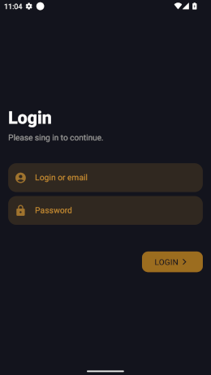

### Quick start

Get API Key (v3 auth) from [site](https://www.themoviedb.org/settings/api). Create a file **apikey.properties** in project root directory with the value api key:

```
api.key="KEY"
```

## Screenshots




